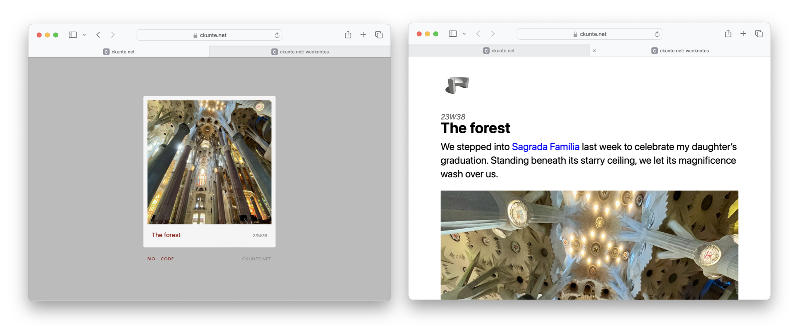

# Mini chisel (mc)

Mini chisel is a static site generator script in [python][p], and enabled by [Jinja][j] templates. 

It is a bare bones fork of [Chisel][c]. It began as a tool to publish week notes, and is now between week notes and a state of _"now"_, reflecting its author's view that permanency (of everyday information) is overrated.

The author's own website is between a week notes weblog and a now page, generated using mini chisel.



## Features

1. Content parsing to generate smart typographic punctuation
1. JSON feed generator
1. No permalinks to notes (html `#id`s available)
1. Templates featuring
    - Customised homepage
    - Custom week notes page

## Sample note

The format for a note in markdown is simple, and is as follows:

1. Line 1: Title
1. Line 2: Date (in the format: Y-m-d HH:MM)
1. Line 3: Cover image URL (Blank line, if none)
1. Line 4: Blank line
1. Line 5: Content in Markdown here onward

```
Chateau de Chambord
2010-05-05 21:50
/img/chambord.jpg

The 50km route from Amboise to Chambord is scenic, the air in early April still uncomfortably cold. The entrance is grand, the chateau looks iconic from afar.
```

[p]: https://www.python.org
[j]: https://jinja.palletsprojects.com/en/
[c]: https://github.com/ckunte/chisel/tree/ck
[n]: https://nownownow.com/about
[l]: https://en.wikipedia.org/wiki/Permalink
